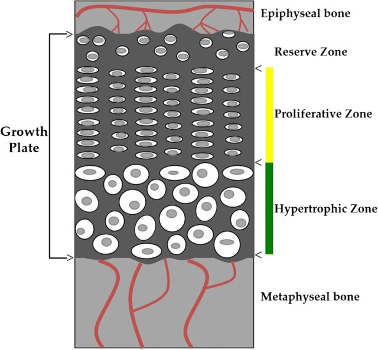

{#fig-growth width=70% fig-pos="htbp"}

See @fig-growth.

See @fig-grid and [@testFileQuarto2026].

::: {#fig-grid fig-pos="htbp"}

```{=latex}
\centering
\setlength{\tabcolsep}{1pt}
\renewcommand{\arraystretch}{1}
\newcommand{\tile}{\includegraphics[width=0.09\linewidth]{images/diagram.jpg}}

\begin{tabular}{@{}*{9}{c}@{}}
\tile & \tile & \tile & \tile & \tile & \tile & \tile & \tile & \tile \\
\tile & \tile & \tile & \tile & \tile & \tile & \tile & \tile & \tile \\
\tile & \tile & \tile & \tile & \tile & \tile & \tile & \tile & \tile \\
\tile & \tile & \tile & \tile & \tile & \tile & \tile & \tile & \tile \\
\tile & \tile & \tile & \tile & \tile & \tile & \tile & \tile & \tile \\
\tile & \tile & \tile & \tile & \tile & \tile & \tile & \tile & \tile \\
\tile & \tile & \tile & \tile & \tile & \tile & \tile & \tile & \tile \\
\tile & \tile & \tile & \tile & \tile & \tile & \tile & \tile & \tile \\
\tile & \tile & \tile & \tile & \tile & \tile & \tile & \tile & \tile \\
\end{tabular}
